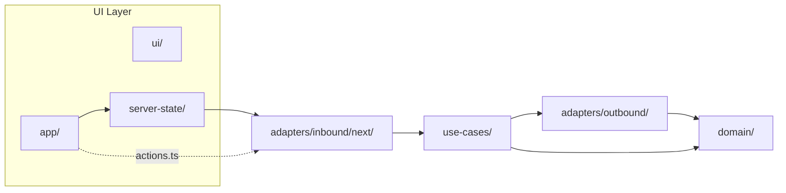

# fullstack-ai-template

[](LICENSE)
[](https://nextjs.org)
[](https://www.typescriptlang.org)
[](https://supabase.com)
[](https://github.com/clicktronix/fullstack-ai-template/actions)

Opinionated full-stack template for AI products and B2B apps, designed for rapid bootstrapping with coding agents (Claude Code, Codex, Cursor).

## Quick Start

```bash
# 1. Create from template
gh repo create my-app --template clicktronix/fullstack-ai-template --clone
cd my-app

# 2. Install
bun install
cp .env.example .env.local          # fill in Supabase keys

# 3. Agent tooling (optional — Claude Code auto-prompts on trust)
bun run setup:mcp                   # MCP servers
bun run setup:skills                # marketplace plugins + Vercel skills

# 4. Rename template
bun run bootstrap -- --name=my-app --title="My App"

# 5. Run
bun run dev                         # http://localhost:3000
```

## Stack

| Layer           | Technology                                    |
| --------------- | --------------------------------------------- |
| Framework       | Next.js 16 (App Router), React 19, TypeScript |
| UI              | Mantine 8, CSS Modules                        |
| Validation      | Valibot (domain schemas + inferred types)     |
| Server State    | TanStack Query                                |
| Page UI State   | Zustand                                       |
| Database        | Supabase (PostgreSQL + Auth)                  |
| i18n            | React Intl                                    |
| Package Manager | Bun                                           |

## Architecture

Hybrid Clean Architecture with strict layer boundaries:

```
app/ui → ui/server-state | actions.ts → inbound adapters → use-cases → outbound adapters → domain
```



| Layer          | Path                         | Purpose                              |
| -------------- | ---------------------------- | ------------------------------------ |
| Domain         | `src/domain/`                | Valibot schemas, pure business rules |
| Use-Cases      | `src/use-cases/`             | Application scenarios, ports         |
| Outbound       | `src/adapters/outbound/`     | Supabase, external APIs              |
| Inbound        | `src/adapters/inbound/next/` | Server Actions, route handlers       |
| Server-State   | `src/ui/server-state/`       | TanStack Query hooks, cache          |
| UI             | `src/app/`, `src/ui/`        | Pages, components, hooks             |
| Infrastructure | `src/infrastructure/`        | Auth, i18n, logging                  |

Full architecture guide: [`docs/ARCHITECTURE/ARCHITECTURE.md`](docs/ARCHITECTURE/ARCHITECTURE.md)

## Agent Tooling

This template ships with complete AI agent configuration:

| Component               | What it does                                         |
| ----------------------- | ---------------------------------------------------- |
| `CLAUDE.md`             | Project context for Claude Code (188 lines, modular) |
| `AGENTS.md`             | Project context for Codex / Cursor                   |
| `.claude/rules/`        | 6 path-scoped rule files auto-loaded by context      |
| `.claude/agents/`       | Code reviewer subagent                               |
| `.claude/settings.json` | Marketplace plugins + hooks + MCP approval           |
| `.mcp.json`             | Supabase, Playwright, Chrome DevTools MCP servers    |

### Marketplace Plugins (auto-install on repo trust)

| Marketplace                       | Plugin                    | Provides                                           |
| --------------------------------- | ------------------------- | -------------------------------------------------- |
| `clicktronix/react-clean-skills`  | `react-clean-skills`      | Clean Architecture + composeHooks component skills |
| `supabase/agent-skills`           | `postgres-best-practices` | Supabase Postgres guidance                         |
| `tanstack-skills/tanstack-skills` | `tanstack-query`          | TanStack Query patterns                            |
| `obra/superpowers-marketplace`    | `superpowers`             | TDD, debugging, collaboration workflows            |

Vercel agent-skills (installed via `bun run setup:skills`): `vercel-react-best-practices`, `vercel-composition-patterns`, `web-design-guidelines`.

Details: [`docs/TEMPLATE_GUIDE/SKILLS_AND_PLUGINS.md`](docs/TEMPLATE_GUIDE/SKILLS_AND_PLUGINS.md)

## Commands

| Command                 | Purpose                               |
| ----------------------- | ------------------------------------- |
| `bun run dev`           | Development server (port 3000)        |
| `bun run build`         | Production build                      |
| `bun run check`         | Lint + typecheck + format + i18n sync |
| `bun test`              | Unit tests (935 tests)                |
| `bun run test:e2e`      | Playwright E2E                        |
| `bun run storybook`     | Component explorer (port 6006)        |
| `bun run bootstrap`     | Rename/rebrand template               |
| `bun run skills:doctor` | Verify plugin install state           |
| `bun run mcp:doctor`    | Verify MCP server state               |

Full list: see `CLAUDE.md` → Commands section.

## What's Included

- Auth baseline (Supabase Auth, role-based access, owner auto-promotion)
- Demo vertical slice (`work-items` + `labels` + optional AI suggestions)
- Smart/Dumb component pattern via `composeHooks(View)(useProps)`
- i18n with `en` + `ru` locales and auto-sync script
- ESLint boundary rules enforcing architecture layers
- Unit tests (Bun + Testing Library), E2E (Playwright)
- Storybook with theme palette stories
- CI workflow (lint, typecheck, test, e2e)
- Docker baseline
- Optional integrations: [Sentry](docs/TEMPLATE_GUIDE/OPTIONAL_SENTRY.md), [AI endpoint](docs/TEMPLATE_GUIDE/OPTIONAL_AI_ENDPOINT.md), [Storybook](docs/TEMPLATE_GUIDE/OPTIONAL_STORYBOOK.md)

## Environment

Copy `.env.example` to `.env.local` and fill in Supabase credentials. All other env vars are optional — see `.env.example` for documentation.

The first signed-up user becomes `owner` automatically; subsequent users start as `pending`.

## Documentation

| Document                                       | Purpose                                                             |
| ---------------------------------------------- | ------------------------------------------------------------------- |
| [`CLAUDE.md`](CLAUDE.md)                       | Agent project context                                               |
| [`docs/ARCHITECTURE/`](docs/ARCHITECTURE/)     | Architecture guide, quick reference, component patterns, theming    |
| [`docs/TESTING/`](docs/TESTING/)               | Testing strategy, patterns by layer, mocking rules                  |
| [`docs/TEMPLATE_GUIDE/`](docs/TEMPLATE_GUIDE/) | Getting started, customization, skills setup, optional integrations |

## License

[MIT](LICENSE)
