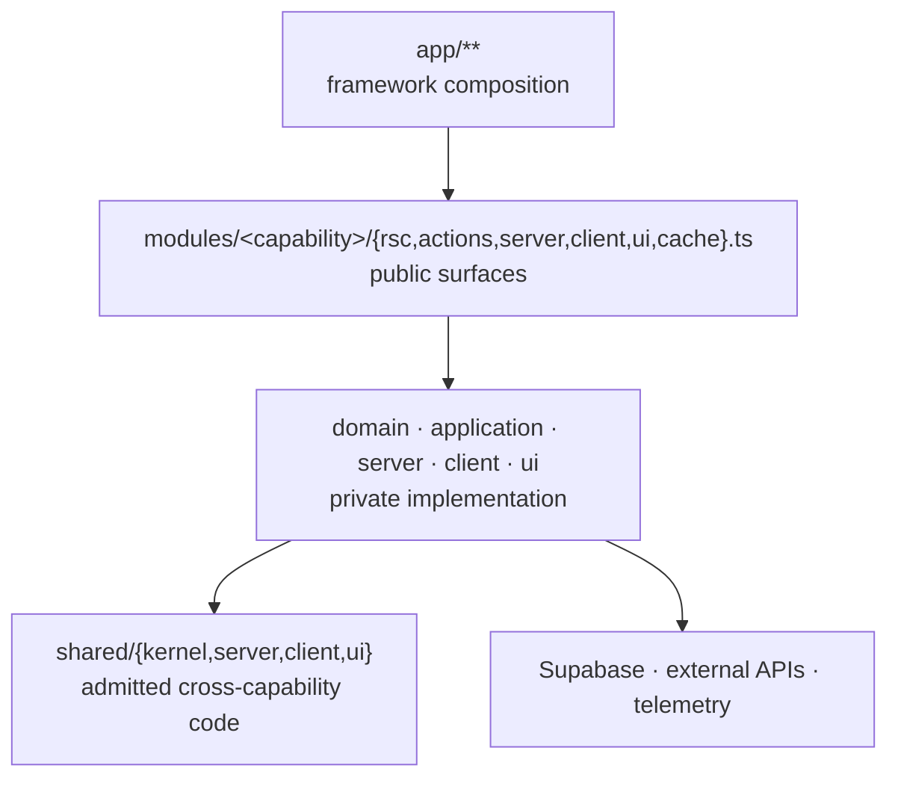

# fullstack-ai-template

[](LICENSE)
[](https://nextjs.org)
[](https://www.typescriptlang.org)
[](https://supabase.com)
[](https://github.com/clicktronix/fullstack-ai-template/actions)

Opinionated full-stack template for AI products and B2B apps, designed for rapid bootstrapping with coding agents (Claude Code, Codex, Cursor).

## Quick Start

```bash
# 1. Create from template
gh repo create my-app --template clicktronix/fullstack-ai-template --clone
cd my-app

# 2. Install
bun install
cp .env.example .env.local          # fill in Supabase keys

# 3. Agent tooling (optional — Claude Code auto-prompts on trust)
bun run setup:mcp                   # MCP servers
bun run setup:skills                # marketplace plugins + Vercel skills

# 4. Rename template
bun run bootstrap -- --name=my-app --title="My App"

# 5. Run
bun run dev                         # http://localhost:3000
```

## Stack

| Layer           | Technology                                    |
| --------------- | --------------------------------------------- |
| Framework       | Next.js 16 (App Router), React 19, TypeScript |
| UI              | Mantine 9, CSS Modules                        |
| Validation      | Valibot (domain schemas + inferred types)     |
| Server State    | TanStack Query                                |
| Page UI State   | React state / reducer in feature-local hooks  |
| Database        | Supabase (PostgreSQL + Auth)                  |
| i18n            | React Intl                                    |
| Package Manager | Bun                                           |

## Architecture

Capability-first architecture: product behavior is colocated under `src/modules/<capability>/`;
runtime-specific entrypoints expose narrow public surfaces at the module root.


```mermaid
flowchart TB
    App["app/**<br/>framework composition"]
    Public["modules/&lt;capability&gt;/{rsc,actions,server,client,ui,cache}.ts<br/>public surfaces"]
    Private["domain · application · server · client · ui<br/>private implementation"]
    Shared["shared/{kernel,server,client,ui}<br/>admitted cross-capability code"]
    Providers["Supabase · external APIs · telemetry"]

    App --> Public
    Public --> Private
    Private --> Shared
    Private --> Providers
```

| Area                  | Path                             | Purpose                                            |
| --------------------- | -------------------------------- | -------------------------------------------------- |
| Product capabilities  | `src/modules/<capability>/`      | Domain, application behavior, runtime adapters, UI |
| Public surfaces       | `src/modules/<capability>/*.ts`  | Narrow runtime-specific contracts                  |
| Framework composition | `src/app/`                       | Routes, layouts, HTTP decoding, channel wiring     |
| Generated contracts   | `src/generated/`                 | Mechanical provider types; adapters only           |
| Shared kernel         | `src/shared/kernel/`             | Pure cross-capability types and functions          |
| Shared runtime code   | `src/shared/{server,client,ui}/` | Admitted runtime-specific utilities                |

Next.js 16 defaults in this template:

- `src/proxy.ts` handles session refresh, auth redirects, and security headers
- Server Actions use `next-safe-action` with Valibot input schemas
- Route Handlers expose service APIs with request-id envelopes and idempotent POST commands
- each capability owns its query keys; a server cache adds tag identities only when its read path
  actually calls `cacheTag()`
- `bun run build` uses the default Turbopack production build

`src/proxy.ts` is not the authorization boundary. Shared server auth verifies the provider user;
the `identity` capability resolves product role/profile, and every target capability re-checks its
own authorization policy.

Full architecture guide: [`wiki/ARCHITECTURE/ARCHITECTURE.md`](wiki/ARCHITECTURE/ARCHITECTURE.md).
Migration measurements: [`wiki/ARCHITECTURE/MIGRATION_EVIDENCE.md`](wiki/ARCHITECTURE/MIGRATION_EVIDENCE.md).

## Agent Tooling

This template ships with complete AI agent configuration:

| Component               | What it does                                         |
| ----------------------- | ---------------------------------------------------- |
| `CLAUDE.md`             | Project context for Claude Code (188 lines, modular) |
| `AGENTS.md`             | Project context for Codex / Cursor                   |
| `.claude/rules/`        | 6 path-scoped rule files auto-loaded by context      |
| `.claude/agents/`       | Code reviewer subagent                               |
| `.claude/settings.json` | Marketplace plugins + hooks + MCP approval           |
| `.mcp.json`             | Supabase, Playwright, Chrome DevTools MCP servers    |

### Marketplace Plugins (auto-install on repo trust)

| Marketplace                       | Plugin                    | Provides                                                    |
| --------------------------------- | ------------------------- | ----------------------------------------------------------- |
| `clicktronix/nextjs-clean-skills` | `nextjs-clean-skills`     | Next.js 16 capability-first architecture + component skills |
| `supabase/agent-skills`           | `postgres-best-practices` | Supabase Postgres guidance                                  |
| `tanstack-skills/tanstack-skills` | `tanstack-query`          | TanStack Query patterns                                     |
| `obra/superpowers-marketplace`    | `superpowers`             | TDD, debugging, collaboration workflows                     |

Vercel agent-skills (installed via `bun run setup:skills`): `vercel-react-best-practices`, `vercel-composition-patterns`, `web-design-guidelines`.

Details: [`wiki/TEMPLATE_GUIDE/SKILLS_AND_PLUGINS.md`](wiki/TEMPLATE_GUIDE/SKILLS_AND_PLUGINS.md)

## Commands

| Command                 | Purpose                               |
| ----------------------- | ------------------------------------- |
| `bun run dev`           | Development server (port 3000)        |
| `bun run build`         | Production build                      |
| `bun run check`         | Lint + typecheck + format + i18n sync |
| `bun test`              | Unit tests                            |
| `bun run test:e2e`      | Playwright E2E                        |
| `bun run storybook`     | Component explorer (port 6006)        |
| `bun run bootstrap`     | Rename/rebrand template               |
| `bun run skills:doctor` | Verify plugin install state           |
| `bun run mcp:doctor`    | Verify MCP server state               |

Full list: see `CLAUDE.md` → Commands section.

## What's Included

- Auth baseline (Supabase Auth, role-based access, owner auto-promotion)
- Demo vertical slice (`work-items` + `labels` + optional AI suggestions)
- Service API example (`GET/POST /api/work-items`) with idempotency and JSON error envelopes
- Webhook example with HMAC signature verification
- Direct named hook calls in client controllers; pure views split only when reuse or server rendering justifies it
- i18n via React Intl with `en` baseline + auto-sync script (extensible to additional locales)
- ESLint boundary rules enforcing capability ownership and server/client direction
- Unit tests (Bun + Testing Library), E2E (Playwright)
- Storybook with theme palette stories
- CI workflow (lint, typecheck, test, e2e)
- Docker baseline
- Optional integrations: [Sentry](wiki/TEMPLATE_GUIDE/OPTIONAL_SENTRY.md), [AI endpoint](wiki/TEMPLATE_GUIDE/OPTIONAL_AI_ENDPOINT.md), [Storybook](wiki/TEMPLATE_GUIDE/OPTIONAL_STORYBOOK.md)

## Environment

Copy `.env.example` to `.env.local` and fill in Supabase credentials. All other env vars are optional — see `.env.example` for documentation.

Runtime code reads env only through `src/shared/{server,client}/env/*`; direct `process.env`
access is intentionally blocked by ESLint outside env helpers and tests.

The first signed-up user becomes `owner` automatically; subsequent users start as `pending`.

## Documentation

| Document                                       | Purpose                                                             |
| ---------------------------------------------- | ------------------------------------------------------------------- |
| [`CLAUDE.md`](CLAUDE.md)                       | Agent project context                                               |
| [`wiki/ARCHITECTURE/`](wiki/ARCHITECTURE/)     | Architecture guide, quick reference, component patterns, theming    |
| [`wiki/TESTING/`](wiki/TESTING/)               | Testing strategy, boundary patterns, and mocking rules              |
| [`wiki/TEMPLATE_GUIDE/`](wiki/TEMPLATE_GUIDE/) | Getting started, customization, skills setup, optional integrations |
| [`CHANGELOG.md`](CHANGELOG.md)                 | Template baseline release notes                                     |

## License

[MIT](LICENSE)
