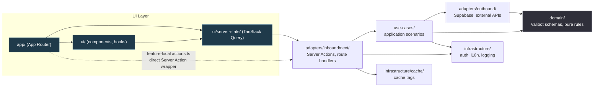

# Architecture

> For a one-page cheatsheet (layer table, allowed imports, demo slice), see [`QUICK_REFERENCE.md`](./QUICK_REFERENCE.md). This document covers **why** the template is structured this way and where the boundaries are enforced.

## Purpose

Reusable baseline for full-stack B2B and AI products built with:

- Next.js App Router, React 19
- Supabase (Postgres + Auth)
- TanStack Query
- Hybrid Clean Architecture

The business vocabulary is intentionally minimal — the template is not a domain-specific starter.

## Why a Hybrid Model

Pure frontend Clean Architecture is usually too abstract for a real Next.js app. Framework-first codebases blur business logic with transport and UI wiring. This template keeps only the useful separations:

- business core in `domain`
- application orchestration in `use-cases`
- framework entrypoints in inbound adapters
- infrastructure and persistence in outbound adapters
- server data concerns in `ui/server-state`

## Layer Diagram

## Layer Responsibilities

| Layer              | What it does                                                                                   | What it must NOT do                                               |
| ------------------ | ---------------------------------------------------------------------------------------------- | ----------------------------------------------------------------- |
| **Domain**         | Valibot schemas, inferred types, invariants, pure helpers                                      | Import anything outside `domain`                                  |
| **Use-Cases**      | Application scenarios, ports (repository types), orchestration                                 | Use `use server`, `NextRequest/Response`, or framework cache APIs |
| **Outbound**       | Supabase repositories, HTTP clients, transport                                                 | Depend on inbound or UI                                           |
| **Inbound**        | Safe Server Actions, route handlers, auth/session context, request mapping, cache invalidation | Contain business logic (delegate to use-cases)                    |
| **Server-State**   | TanStack Query keys/hooks, SSR prefetch, cache orchestration                                   | Be imported by non-UI code                                        |
| **UI**             | App Router pages, components, view hooks, providers, themes                                    | Import outbound adapters directly                                 |
| **Infrastructure** | Cross-cutting glue: auth helpers, locale wiring, config access, logging                        | Contain feature logic                                             |

## Intentional Exceptions

- **feature-local `actions.ts`** — thin direct Server Action wrappers are allowed in UI segments without going through `ui/server-state`. Use only for one-off operations that do not need TanStack Query semantics.
- **`ui/server-state` depends on inbound adapters** — necessary to call Server Actions inside `queryFn`. This is the one layer permitted to cross the UI ↔ adapter boundary.

Both exceptions are enforced by ESLint boundaries (`eslint.config.mjs`).

## Next.js 16 Defaults

- Use `src/proxy.ts` for request-time redirects, session refresh, and security headers. Do not make proxy the only authorization boundary.
- Use DAL helpers such as `createAuthenticatedContext()` inside Server Actions, Route Handlers, and server-side data access.
- Use `next-safe-action` for inbound Server Actions that accept user input. Keep the exported action function stable, but put `.inputSchema(...)`, auth middleware, and role checks in the safe-action client.
- Use Route Handlers for external/service HTTP APIs. They should create an API context, return request-id JSON envelopes, and use idempotency keys for retryable commands.
- Prefer tag-based cache invalidation: Server Actions may use `updateTag()` for read-your-writes and `revalidateTag(tag, profile)` for broader invalidation. Route Handlers use `revalidateTag(tag, profile)` / `revalidatePath(path)` only; `updateTag()` is Server Action-only.
- Cache Components are enabled at the top level in `next.config.ts`; place `Suspense` boundaries around dynamic holes.

## Locale Detection

`src/proxy.ts` sets the locale cookie from `Accept-Language` on the first request when the cookie is missing. `LocaleProvider` then resolves the browser locale in this order:

1. `localStorage`
2. Locale cookie
3. Default locale (`en`)

The parser lives in `src/infrastructure/i18n/locale-detection.ts` so proxy and tests share the same behavior. Do not read `cookies()` or `headers()` directly in the root layout only for locale detection: with `cacheComponents: true`, runtime data must sit under a `Suspense` boundary. If the product needs first-byte localized HTML instead of client-side locale activation, use a locale route segment or migrate the i18n layer intentionally.

## Cache Components Gotchas

With `cacheComponents: true`, request-time data such as `cookies()`, `headers()`, `connection()`, `params`, and `searchParams` creates dynamic holes. Put `Suspense` boundaries around the smallest component that needs that data.

Client hooks such as `usePathname()` and `useSearchParams()` can also force a client-side dynamic boundary when used under dynamic App Router segments. If a provider needs them, isolate that provider under `Suspense` without hiding the rest of the shell.

Do not use `fallback={null}` around a large layout or provider tree when no-JS forms must remain visible. Login/signup use `useActionState` plus `<form action={formAction}>`; their parent shell must render enough HTML for progressive submission before hydration.

## Reference Slice

The `work-items` + `labels` vertical slice is the canonical example. Follow its layer order when adding features — see [`USE_CASES.md`](./USE_CASES.md), [`DATA_ACCESS.md`](./DATA_ACCESS.md), and [`BACKEND_SERVICE_PATTERNS.md`](./BACKEND_SERVICE_PATTERNS.md).

## Where Rules Live

- **Runtime**: ESLint boundary rules in `eslint.config.mjs` catch leaks at build time
- **Agents**: `.claude/rules/architecture.md` and `.claude/rules/core.md` are auto-loaded by Claude Code for relevant paths
- **Humans**: This document + `QUICK_REFERENCE.md`
