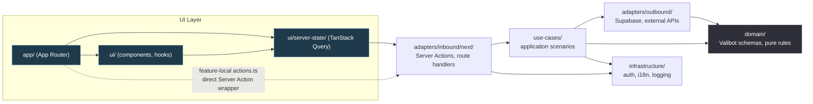

# Architecture

> For a one-page cheatsheet (layer table, allowed imports, demo slice), see [`QUICK_REFERENCE.md`](./QUICK_REFERENCE.md). This document covers **why** the template is structured this way and where the boundaries are enforced.

## Purpose

Reusable baseline for full-stack B2B and AI products built with:

- Next.js App Router, React 19
- Supabase (Postgres + Auth)
- TanStack Query
- Hybrid Clean Architecture

The business vocabulary is intentionally minimal — the template is not a domain-specific starter.

## Why a Hybrid Model

Pure frontend Clean Architecture is usually too abstract for a real Next.js app. Framework-first codebases blur business logic with transport and UI wiring. This template keeps only the useful separations:

- business core in `domain`
- application orchestration in `use-cases`
- framework entrypoints in inbound adapters
- infrastructure and persistence in outbound adapters
- server data concerns in `ui/server-state`

## Layer Diagram

## Layer Responsibilities

| Layer              | What it does                                                                              | What it must NOT do                                        |
| ------------------ | ----------------------------------------------------------------------------------------- | ---------------------------------------------------------- |
| **Domain**         | Valibot schemas, inferred types, invariants, pure helpers                                 | Import anything outside `domain`                           |
| **Use-Cases**      | Application scenarios, ports (repository types), orchestration                            | Use `use server`, `NextRequest/Response`, `revalidatePath` |
| **Outbound**       | Supabase repositories, HTTP clients, transport                                            | Depend on inbound or UI                                    |
| **Inbound**        | Server Actions, route handlers, auth/session context, request mapping, cache invalidation | Contain business logic (delegate to use-cases)             |
| **Server-State**   | TanStack Query keys/hooks, SSR prefetch, cache orchestration                              | Be imported by non-UI code                                 |
| **UI**             | App Router pages, components, view hooks, providers, themes                               | Import outbound adapters directly                          |
| **Infrastructure** | Cross-cutting glue: auth helpers, locale wiring, config access, logging                   | Contain feature logic                                      |

## Intentional Exceptions

- **feature-local `actions.ts`** — thin direct Server Action wrappers are allowed in UI segments without going through `ui/server-state`. Use only for one-off operations that do not need TanStack Query semantics.
- **`ui/server-state` depends on inbound adapters** — necessary to call Server Actions inside `queryFn`. This is the one layer permitted to cross the UI ↔ adapter boundary.

Both exceptions are enforced by ESLint boundaries (`eslint.config.ts`).

## Reference Slice

The `work-items` + `labels` vertical slice is the canonical example. Follow its layer order when adding features — see [`USE_CASES.md`](./USE_CASES.md) and [`DATA_ACCESS.md`](./DATA_ACCESS.md).

## Where Rules Live

- **Runtime**: ESLint boundary rules in `eslint.config.ts` catch leaks at build time
- **Agents**: `.claude/rules/architecture.md` and `.claude/rules/core.md` are auto-loaded by Claude Code for relevant paths
- **Humans**: This document + `QUICK_REFERENCE.md`
