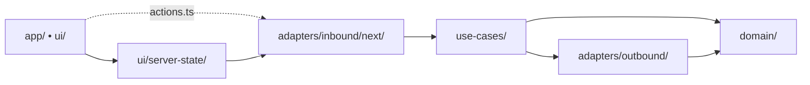

# Quick Reference

One-page cheatsheet. For rationale and exceptions, see [`ARCHITECTURE.md`](./ARCHITECTURE.md).

## Dependency Flow



```text
app/ui -> ui/server-state | actions.ts -> inbound adapters -> use-cases -> outbound adapters -> domain
```

## Layer Map

| Layer          | Path                         | Purpose                                           |
| -------------- | ---------------------------- | ------------------------------------------------- |
| Domain         | `src/domain/`                | Schemas, invariants, pure helpers                 |
| Use-Cases      | `src/use-cases/`             | Application scenarios, ports, feature-local types |
| Server-State   | `src/ui/server-state/`       | TanStack Query hooks, keys, SSR prefetch          |
| Inbound        | `src/adapters/inbound/next/` | Safe Server Actions, route handlers               |
| Outbound       | `src/adapters/outbound/`     | Supabase, external APIs, transport                |
| UI             | `src/app/`, `src/ui/`        | Next entrypoints and presentation                 |
| Infrastructure | `src/infrastructure/`        | Auth, i18n, config, logging                       |

## Rules

- `src/use-cases/**` must not import `app`, `ui`, or inbound adapters
- `src/ui/server-state/**` is the only UI-facing layer allowed to call inbound adapters
- feature-local `actions.ts` allowed only for thin direct Server Action wrappers
- UI must not import outbound adapters directly
- `app/` entrypoints stay thin
- inbound Server Actions validate input through `next-safe-action`
- cache invalidation uses `cacheTags`, `updateTag()`, and `revalidateTag(tag, profile)`
- `src/proxy.ts` refreshes sessions and redirects; DAL helpers re-check authorization in server code

## Demo Slice

`work-items` + `labels` — the canonical reference. Exercises every layer: domain schemas, use-case ports, Supabase outbound, Server Actions, TanStack Query, SSR prefetch, `composeHooks` UI.
