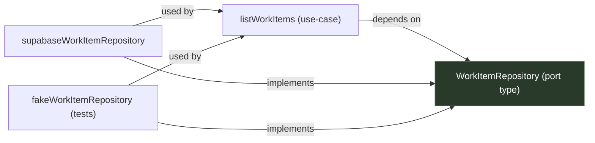

# Use-Cases

## What Belongs Here

`src/use-cases/` contains:

- application scenarios
- ports
- feature-local types
- lightweight orchestration

It does **not** contain:

- `use server`
- `NextRequest` / `NextResponse`
- React hooks
- TanStack Query logic

## Reference Example

```text
src/use-cases/work-items/
├── work-items.ts
├── ports.ts
└── types.ts
```

Example:

```ts
import type { WorkItemRepository } from './ports'
import type { WorkItemFilters } from './types'

export async function listWorkItems(
  deps: { workItems: WorkItemRepository },
  filters: WorkItemFilters
) {
  return deps.workItems.list(filters)
}
```

## Ports

Ports define what a use-case needs from the outside world.

```ts
export type WorkItemRepository = {
  list: (filters: WorkItemFilters) => Promise<WorkItem[]>
  create: (input: CreateWorkItemInput) => Promise<WorkItem>
}
```

The use-case depends on the contract. Outbound adapters implement it.



## Relationship to Server-State

React Query integration does not live in `use-cases`.

Instead:

```text
src/ui/server-state/work-items/
├── keys.ts
├── queries.ts
├── mutations.ts
└── prefetch.ts
```

This keeps the application layer clean while still colocating server-data logic by feature.
