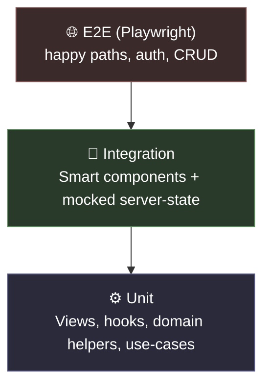

# Testing Strategy

Comprehensive guide for testing in this template. For a minimal cheatsheet loaded automatically when editing test files, see [`.claude/rules/quality.md`](../../.claude/rules/quality.md).

## Stack

| Layer         | Tool                                                                                             | Config                          |
| ------------- | ------------------------------------------------------------------------------------------------ | ------------------------------- |
| Unit runner   | [Bun test](https://bun.sh/docs/cli/test) + [happy-dom](https://github.com/capricorn86/happy-dom) | `tests/setup.ts`, `bunfig.toml` |
| React testing | `@testing-library/react` + `jest-dom`                                                            | `tests/jest-dom.d.ts`           |
| E2E           | [Playwright](https://playwright.dev)                                                             | `e2e/playwright.config.ts`      |
| Coverage      | Bun built-in (lcov + text)                                                                       | `bun test --coverage`           |

## Testing Pyramid



- **Unit** — bulk of tests; fast, zero network.
- **Integration** — one per feature, covers Smart component + its `lib.ts` with `ui/server-state` mocked.
- **E2E** — minimal happy-path coverage for auth, protected routes, baseline CRUD. Use the `e2e-testing` skill for new scenarios.

## Commands

| Command                         | Purpose                       |
| ------------------------------- | ----------------------------- |
| `bun test`                      | Run all unit tests            |
| `bun test path/to/file.test.ts` | Run a single file             |
| `bun run test:watch`            | Watch mode                    |
| `bun run test:coverage`         | Coverage report (text + lcov) |
| `bun run test:ci`               | Single-concurrency; use in CI |
| `bun run test:e2e`              | Playwright suite              |

## Patterns by Layer

### Domain (pure functions)

Test schemas and helpers directly. No setup, no mocks.

```ts
import { expect, test } from 'bun:test'
import { parse } from 'valibot'
import { WorkItemSchema } from '@/domain/work-item'

test('WorkItemSchema trims title', () => {
  const result = parse(WorkItemSchema, {
    id: 'x',
    title: '  hello  ',
    description: null,
    archived: false,
  })
  expect(result.title).toBe('hello')
})
```

### Use-Cases (orchestration)

Inject fake repositories (pure ports). No Supabase, no Next.js.

```ts
import { expect, test } from 'bun:test'
import { listWorkItems } from '@/use-cases/work-items'

test('listWorkItems filters by archived', async () => {
  const fakeRepo = {
    list: async (filters) => (filters.archived ? [] : [{ id: '1', title: 'A' }]),
  }
  const result = await listWorkItems({ workItems: fakeRepo }, { archived: false })
  expect(result).toHaveLength(1)
})
```

### Dumb Components (View)

Render with explicit props; assert rendering, not behavior.

```tsx
import { render, screen } from '@testing-library/react'
import { expect, test } from 'bun:test'
import { WorkItemCardView } from './index'

test('WorkItemCardView renders title and description', () => {
  render(
    <WorkItemCardView
      title="T"
      description="D"
      status="open"
      isPriority={false}
      isLoading={false}
      onEdit={() => {}}
      onArchive={() => {}}
    />
  )
  expect(screen.getByText('T')).toBeInTheDocument()
  expect(screen.getByText('D')).toBeInTheDocument()
})
```

### Hooks (lib.ts / useProps)

Mock `ui/server-state` hooks — **never** mock outbound adapters or Supabase directly.

```tsx
import { renderHook } from '@testing-library/react'
import { expect, mock, test } from 'bun:test'
import { useWorkItemCardProps } from './lib'

mock.module('@/ui/server-state/work-items/queries', () => ({
  useWorkItem: () => ({ data: { title: 'mocked' }, isLoading: false }),
}))

test('useWorkItemCardProps maps server data to view props', () => {
  const { result } = renderHook(() => useWorkItemCardProps({ workItemId: '1' }))
  expect(result.current.title).toBe('mocked')
})
```

### Smart Components (integration)

Wrap in `QueryClientProvider` + `IntlProvider` via `tests/utils/render.tsx`. Mock `ui/server-state` hooks.

### E2E (Playwright)

```ts
import { expect, test } from '@playwright/test'

test('user can sign up and reach protected route', async ({ page }) => {
  await page.goto('/signup')
  await page.getByLabel('Email').fill('test@example.com')
  await page.getByLabel('Password').fill('correct-horse-battery-staple')
  await page.getByRole('button', { name: 'Create account' }).click()
  await expect(page).toHaveURL('/admin/work-items')
})
```

Run `bun run test:e2e` — the config auto-loads `.env.test` then `.env.local`.

## Mocking Rules

| Mock                                     | When                                          |
| ---------------------------------------- | --------------------------------------------- |
| ✅ `@/ui/server-state/**` hooks          | Testing Smart components or feature lib.ts    |
| ✅ `next/navigation` (`useRouter`, etc.) | Any UI that navigates                         |
| ✅ `@/infrastructure/auth/**`            | Testing protected UI                          |
| ❌ Outbound adapters (Supabase, fetch)   | Never — test behind use-case ports instead    |
| ❌ Use-cases in UI tests                 | Never — mock one layer up (`ui/server-state`) |

Shared Supabase fake: `tests/mocks/supabase.ts`.

## Coverage Targets

No hard thresholds enforced in CI (yet). Soft guidelines:

- Domain: 100% — pure code, no excuse
- Use-cases: 90%+ happy + error paths
- Hooks (lib.ts): 80%+ prop mapping
- Views: spot-check, don't chase pixel coverage
- E2E: one happy path per critical flow (auth, CRUD, admin gate)

## Naming & Location

- Unit: co-located `Component/__tests__/index.test.tsx` or `feature/__tests__/feature.test.ts`
- E2E: `e2e/<flow>.spec.ts`
- Fixtures: `tests/fixtures/` for shared builders

## When Tests Fail in Hooks

The Stop hook runs `bun run check`, not `bun test`. Run tests manually before finishing a task: `bun test` (or `bun test:coverage` for a quick reality check).

## References

- [`.claude/rules/quality.md`](../../.claude/rules/quality.md) — auto-loaded for `*.test.{ts,tsx}` files
- [`.agents/skills/e2e-testing/SKILL.md`](../../.agents/skills/e2e-testing/SKILL.md) — structured flow for authoring E2E scenarios
- [Bun test docs](https://bun.sh/docs/cli/test)
- [Testing Library queries cheatsheet](https://testing-library.com/docs/queries/about)
