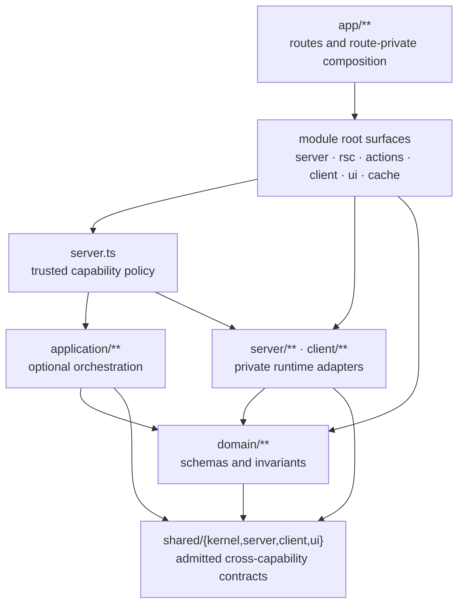
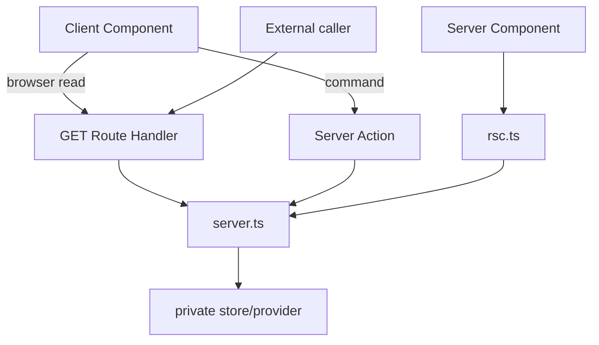
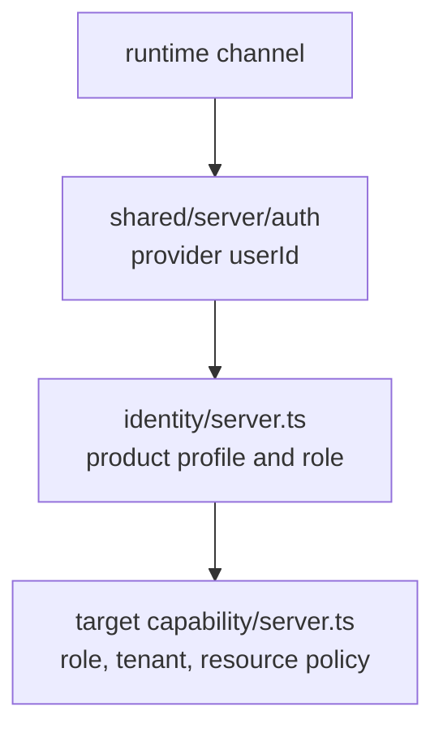
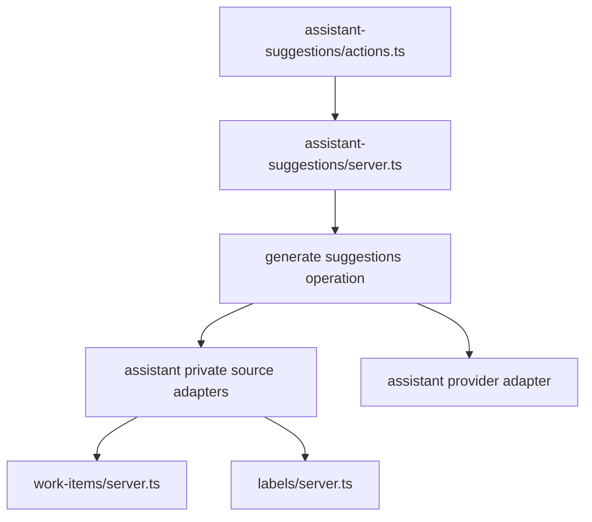

# Architecture

This template organizes product code by capability and separates runtime channels explicitly. The
goal is local reasoning: a developer should find a feature's policy, server adapters, browser
lifecycle, and reusable UI in one module without crossing a repository-wide layer tree.

## System Map



The arrows show allowed knowledge, not mandatory hops. Simple CRUD does not need an application
operation. A Server Component does not call an HTTP route in its own process.

## Physical Model

```text
src/
├── app/
│   ├── api/
│   ├── (public)/
│   ├── (protected)/
│   └── _internal/
├── generated/
│   └── supabase/
├── modules/
│   ├── identity/
│   ├── work-items/
│   ├── labels/
│   └── assistant-suggestions/
└── shared/
    ├── kernel/
    ├── server/
    ├── client/
    └── ui/
```

`app/**` is a framework-owned composition tree. Route-private UI and application-wide runtime
composition, such as the product locale catalog or mapping provider realtime events to capability
query keys, stay here.
`generated/**` contains mechanical provider contracts and is visible only to private runtime
adapters.
`modules/**` is the product ownership tree. `shared/**` contains only contracts that pass the
shared-admission gate.

### Capability Granularity

A module represents one coherent product goal, vocabulary, policy, and lifecycle. Do not map tables,
CRUD screens, routes, providers, or repeated role checks directly to modules. Keep related reference
entities in the taxonomy or workflow capability they support. Split only for a distinct actor
outcome, independent policy or lifecycle, independent change authority, or a narrower stable public
contract.

## Capability Contract

Segments are optional:

| Segment        | Owns                                     | Must not own                         |
| -------------- | ---------------------------------------- | ------------------------------------ |
| `domain/`      | schemas, values, invariants              | framework or provider code           |
| `application/` | real policy, projection, orchestration   | runtime adapters or reporting        |
| `server/`      | stores, provider clients, server mapping | browser lifecycle                    |
| `client/`      | HTTP reads, query cache, subscriptions   | server secrets or DB clients         |
| `ui/`          | reusable capability presentation         | route composition or server adapters |

Public surfaces are root files:

| Surface          | Contract                                                                  |
| ---------------- | ------------------------------------------------------------------------- |
| `server.ts`      | trusted in-process server API; explicit identity/effects; silent failures |
| `rsc.ts`         | Server Component reads and TanStack prefetch                              |
| `actions.ts`     | UI commands through top-level `'use server'`                              |
| `client.ts`      | browser-safe query, mutation, and subscription API                        |
| `ui.ts`          | reusable capability-owned UI                                              |
| `query-cache.ts` | query-key identity shared by RSC prefetch and browser queries             |
| `stream.ts`      | stream setup and pre-commit response contract                             |
| `job.ts`         | background job entrypoint                                                 |

`app/**` and other capabilities import these root surfaces, not internal directories. Public
surfaces use named exports and never `export *`.

## Runtime Channels



Rules:

1. RSC reads call `rsc.ts` or `server.ts` directly.
2. Browser reads use GET or a stream so browser cache semantics remain available.
3. Server Actions are command transport. They are not a query RPC.
4. Route Handlers decode HTTP and map the capability result to HTTP.
5. Trusted `server.ts` enforces capability policy and reports nothing.

## Identity and Effects

Trusted server functions make authority and runtime dependencies visible:

```ts
type WorkItemsIdentity = {
  actorId: string
  role: string
}

type WorkItemsEffects = {
  supabase: SupabaseServerClient
}
```

Shared auth verifies the provider session and returns only `userId` plus server effects. The
`identity` capability resolves the product profile and role. The target capability receives that
explicit identity and rechecks its own policy even if Proxy middleware already redirected the
request.



`src/proxy.ts` is navigation and session-refresh support, not an authorization boundary.

## Application Depth

Create `application/**` only when deleting the operation moves meaningful complexity into callers:

- policy or branching;
- projection across sources;
- transaction intent;
- behavior shared by runtime channels;
- orchestration across capabilities or providers.

Do not create an operation for validation, telemetry, row mapping, cache invalidation, or a direct
store call alone.

Simple path:

```text
channel -> server.ts -> private store
```

Behavioral path:

```text
channel -> server.ts -> application operation -> explicit ports -> private adapters
```

## Ports

A port belongs to the application behavior that needs it. Add one only when:

1. application behavior must name a capability independent of technology;
2. the contract uses application language rather than CRUD/SDK vocabulary;
3. inversion protects current volatility, ownership, or isolation;
4. a production consumer exists.

Adapter count, locality, and test doubles are evidence, not gates. A local database can remain a
private store without a repository interface.

## Cross-Capability Workflows

`assistant-suggestions` is the reference orchestrator:



The orchestrator owns the workflow in its vocabulary. Source capabilities expose narrow public
surfaces and do not import the orchestrator or each other. The graph must remain acyclic.

## Shared Admission

Allowed roots:

| Root            | Examples                                                                      |
| --------------- | ----------------------------------------------------------------------------- |
| `shared/kernel` | error codes, pure cross-capability contracts, pure redaction                  |
| `shared/server` | safe actions, API envelopes, provider authentication, env, server SDK support |
| `shared/client` | browser env, browser SDK transport, client observability                      |
| `shared/ui`     | providers, i18n mechanics, formatters, themes, reusable primitives            |

Code enters shared only when all are true:

1. two real capabilities consume it;
2. meaning and lifecycle are identical;
3. no capability is the natural owner;
4. the contract is narrow and maintained;
5. copying is now more expensive than coordinating it.

`shared/kernel` additionally requires identical terminology, invariants, and change cadence.
Demote or delete shared code when consumers diverge.

Generated provider schemas are not domain or shared-kernel language. Keep them under
`src/generated` and import them only from private capability server/client adapters or shared
server/client runtime code.

Shared UI mechanisms do not own product copy. The locale catalog is app composition and is passed
to the neutral locale provider.

## Failure Ownership

Expected failures are typed/coded outcomes. Unexpected failures are reported once at the outer
runtime boundary:

| Boundary                           | Responsibility                                               |
| ---------------------------------- | ------------------------------------------------------------ |
| `server.ts` / application / stores | throw or return meaningful failures; no telemetry            |
| `actions.ts`                       | command result serialization and one unexpected-error report |
| Route Handler                      | HTTP status/envelope and one unexpected-error report         |
| RSC                                | let the nearest route error boundary own presentation        |
| Query/Mutation client              | user feedback; avoid recapturing marked server incidents     |

Framework control-flow exceptions such as redirects remain outside broad catches.

## Cache Ownership

- A capability exposes `query-cache.ts` only when RSC prefetch and browser queries consume the
  same serializable TanStack Query key identity.
- `query-cache.ts` imports only the capability's domain and `shared/kernel`; it contains no
  fetchers, provider code, Next cache tags, or invalidation.
- A server tag exists only when a read assigns it with `cacheTag`. Do not invalidate ceremonial
  tags that no cache entry owns. Keep tag identities private under the capability's `server/**`.
- The successful runtime channel owns invalidation timing: Server Actions use `updateTag`; Route
  Handlers use `revalidateTag`.
- RSC prefetch and browser hooks import the same capability query-key shapes.
- Client mutations and app-level realtime composition invalidate public capability query keys;
  generic provider subscription transport remains in `shared/client`.
- Client cache is for browser-owned lifecycle: background refresh, optimistic updates, realtime,
  pagination, or infinite queries.
- Do not add TanStack Query to a static RSC read with no browser lifecycle.

## Enforcement

`bun run lint .` checks:

- app and cross-capability imports use public surfaces;
- domain/application purity;
- server/client direction;
- runtime-neutral cache surfaces cannot pull either runtime into the other;
- valid shared roots;
- provider-generated contracts stay out of domain/application/UI and app composition;
- narrow public exports;
- resolved imports and file-level cycles.

`bun run architecture:check` checks capability-level cycles.

These checks do not prove semantic depth, authorization correctness, cache invalidation,
transaction scope, report-once behavior, or shared admission. Those remain review and test
responsibilities.

See [Data Access](./DATA_ACCESS.md), [Component Patterns](./COMPONENT_PATTERNS.md), and the
[Quick Reference](./QUICK_REFERENCE.md).
