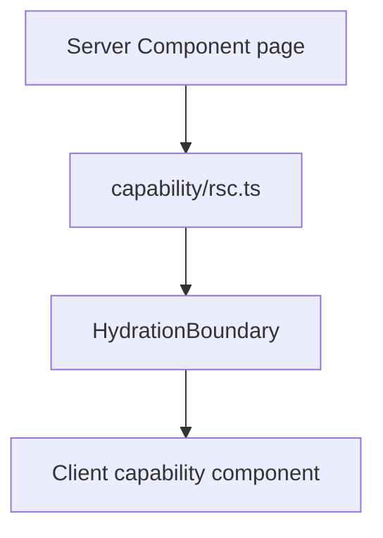

# Component Patterns

React composition follows product ownership and runtime behavior. A component does not earn a new
layer or helper merely because it contains a hook.

## Placement

| Reuse                                                | Location                                  |
| ---------------------------------------------------- | ----------------------------------------- |
| One route                                            | `app/<route>/_internal/ui`                |
| One capability across routes                         | `modules/<capability>/ui` through `ui.ts` |
| Several capabilities, identical presentation meaning | admitted `shared/ui`                      |

Route-private code is not imported outside its owning route segment.

## Server First

Keep components server-rendered unless they need event handlers, browser APIs, context, or
interactive state.



RSC reads call the capability directly. Do not fetch the app's own Route Handler from the server.

## Direct Hook Pattern

```tsx
'use client'

export function WorkItemsPanel(props: WorkItemsPanelProps) {
  const viewProps = useWorkItemsPanelProps(props)
  return <WorkItemsPanelView {...viewProps} />
}
```

The hook call is visible to React tooling and local readers. The View split is optional.

Use a separate View when:

- the presentation has a useful independent test surface;
- the controller data shape is materially different from external props;
- the render body is large enough that separation improves reading.

Keep one component when the split would create a forwarding file with no local reasoning benefit.

Do not pass hooks as values, create higher-order hook composers, or restore `composeHooks`.

## Client Queries

Browser query hooks live in the capability's `client/` segment and are exported through
`client.ts`:

```tsx
export function WorkItemsPanel() {
  const query = useWorkItems({ status: 'active' })

  if (query.isPending) return <WorkItemsSkeleton />
  if (query.isError) return <WorkItemsError error={query.error} />
  if (query.data.items.length === 0) return <WorkItemsEmpty />

  return <WorkItemsList items={query.data.items} />
}
```

Model loading, empty, expected error, unexpected error, disabled, and success states explicitly.

## Commands and Forms

Forms call exact capability actions. The form controller owns local pending/error state; the
Server Action parses again and enforces authorization.

```tsx
export function WorkItemForm(props: WorkItemFormProps) {
  const { form, onSubmit, isSubmitting } = useWorkItemForm(props)

  return (
    <form onSubmit={onSubmit}>
      <TextInput {...form.getInputProps('title')} />
      <Button type="submit" loading={isSubmitting}>
        <TranslationText {...messages.save} />
      </Button>
    </form>
  )
}
```

Keep redirects outside broad catches because Next navigation uses framework-controlled throws.

## Context

Use Context for genuinely app-wide or capability-wide UI state, not server data. Current examples:

- identity auth context under `modules/identity/ui`;
- locale provider under `shared/ui/providers`;
- TanStack Query provider under `shared/ui/providers`.

Product-specific providers are composed from `app/_internal`, not imported into shared providers.

## Memoization

Do not add `memo`, `useMemo`, or `useCallback` by default. Use them for semantic stability required
by an API or after measuring a rerender/performance problem. Removing the old composer intentionally
removed its automatic `memo`.

## Styling and i18n

- Mantine components and props for common UI.
- CSS Modules for selectors, responsive layout, and repeated states.
- Theme tokens instead of hardcoded colors.
- `TranslationText`/`TranslationTitle` plus local `messages.json`.
- Stable dimensions for controls and loading placeholders.

## Tests

- Test pure Views directly when they exist.
- Test controllers through user-observable behavior.
- Mock capability public client/action surfaces, not private stores.
- Use `tests/utils/render.tsx` for Query and Intl providers.
- E2E critical workflows with stable `data-testid` values.
