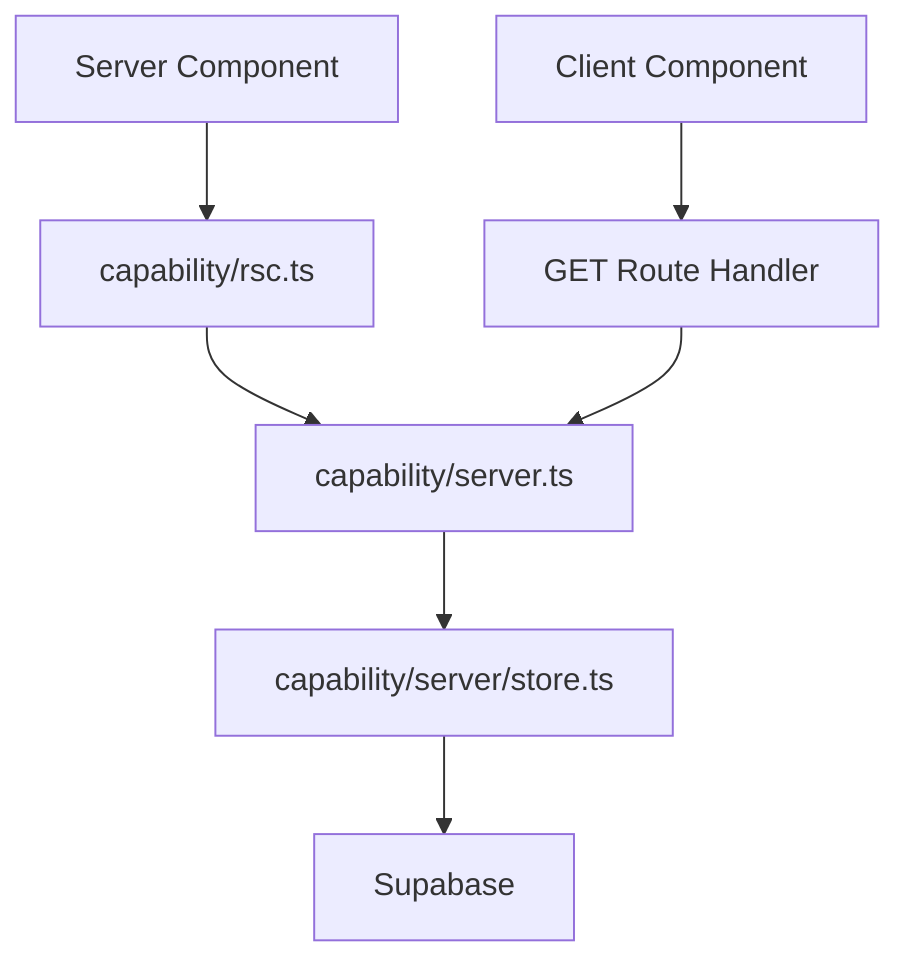
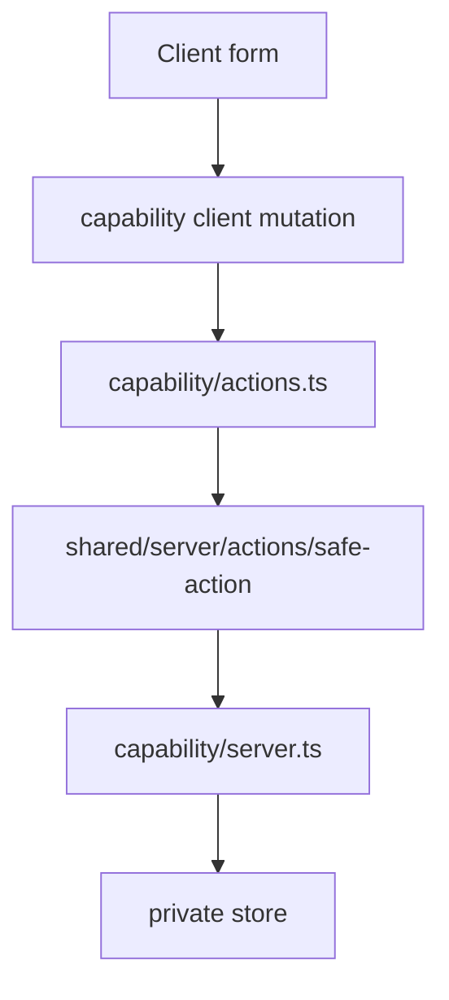
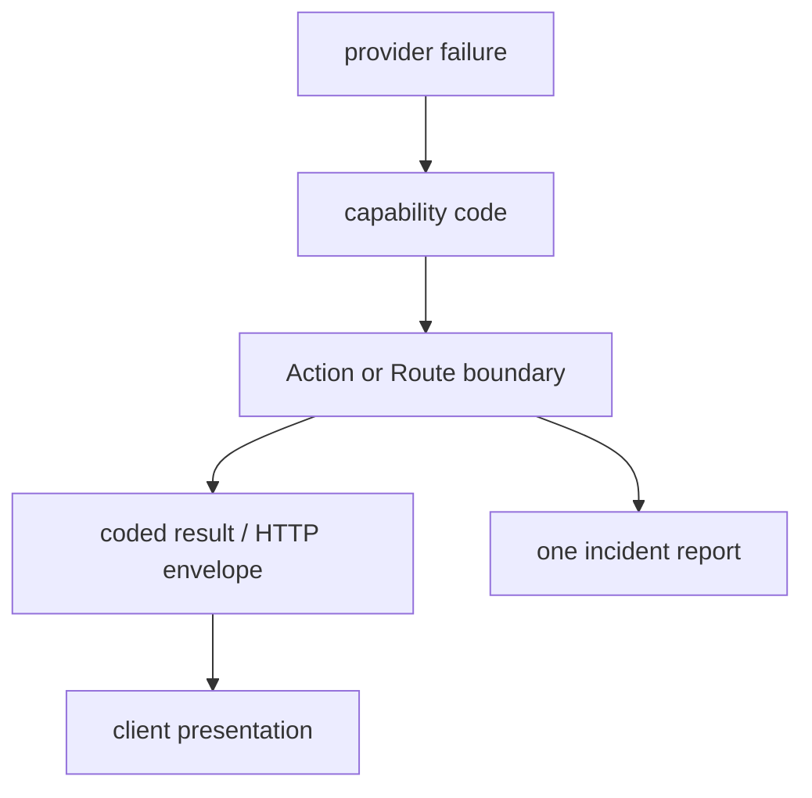

# Data Access

Data access is owned by capabilities and exposed through channel-specific root surfaces.

## Read Paths



RSC calls in-process code. Browser queries use GET for explicit HTTP semantics and independent
browser query lifecycle. Route Handlers are not cached by default; this template keeps private
reads dynamic and lets TanStack Query own browser freshness. Both paths use the same trusted
capability policy and private store.

## Command Path



`actions.ts` starts with top-level `'use server'`. It parses untrusted input, verifies provider
identity, resolves product identity through `identity/server.ts`, invokes the target `server.ts`,
and returns a serializable result. The client mutation invalidates its TanStack Query keys after
success. If a capability has a real Next server cache, the owning server channel also invalidates
the tags assigned by that cached read. `actions.ts` contains no browser read functions.

## Trusted Server Surface

```ts
export function listWorkItems(
  identity: WorkItemsIdentity,
  effects: WorkItemsEffects,
  params: WorkItemListParams
): Promise<PaginatedWorkItemsResult>
```

Identity and effects are explicit. The surface:

- enforces capability authorization;
- accepts already decoded typed input;
- calls private adapters or application behavior;
- propagates meaningful failures;
- performs no Sentry reporting.

## Stores and Provider Adapters

Private server adapters live under the capability's `server/` segment. They:

- use provider SDKs and generated row types;
- select explicit columns;
- map and validate provider data before returning domain values;
- normalize provider failures;
- remain invisible to app routes and other capabilities.

Do not create a repository interface for a local table by default. Add an application port only
when application behavior needs a technology-independent capability contract.

## Cross-Capability Reads

An orchestrator defines narrow source ports in its own vocabulary. Its private source adapters call
the source capabilities' `server.ts` surfaces:

```text
assistant application port
  -> assistant server source adapter
    -> work-items/server.ts
```

The source capability does not import the orchestrator. Authorization-sensitive joins resolve
visible, missing, and forbidden references deliberately; silent omission is not a substitute for a
required rejection.

## Auth

`src/proxy.ts` may refresh sessions and redirect. It is not an authorization boundary.

Server channels establish provider `userId` through `shared/server/auth`, then resolve product
profile and role through `modules/identity/server.ts`. The target capability still checks its own
role, tenant, or ownership rule in `server.ts`. Browser auth lifecycle belongs to
`modules/identity/client`.

## Failure Mapping



Expected failures map to stable codes/statuses. Unexpected failures are captured once by the outer
boundary. A `:captured` marker prevents browser cache/error boundaries from reporting the same
server incident again.

Streaming has a temporal boundary: status/result mapping is possible before response commit; after
the first byte, failures travel in-band.

## Cache

Query keys live in the owning capability's `cache.ts`; RSC prefetch and browser hooks use the same
key shape. Add server tag identities only for reads that assign those tags with `cacheTag`.
Successful Server Actions may call `updateTag` for read-your-own-writes; Route Handlers use
`revalidateTag`. Work-item and label reads in this template are dynamic, so their cache files
contain browser query keys but no inert server tags.

Generic realtime subscription transport lives in `shared/client`; the app-level composition maps
provider table events to public capability query keys. No technical `live-updates` product
capability is required.

Use TanStack Query when the browser owns refresh, optimistic state, realtime invalidation,
pagination, or infinite loading. Do not add it to a static RSC-only read.

## Tests

- `server.ts`: role and ownership policy.
- store/provider: explicit columns, mapping, malformed rows, provider errors.
- route/action: input, envelope, idempotency, cache, report-once.
- client query: GET transport, envelope validation, keys, retries, user feedback.
- RSC: direct server behavior and hydration keys.
