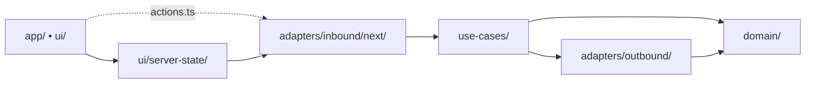

# Quick Reference

One-page cheatsheet. For rationale and exceptions, see [`ARCHITECTURE.md`](./ARCHITECTURE.md).

## Dependency Flow



```text
app/ui -> ui/server-state | actions.ts -> inbound adapters -> use-cases -> outbound adapters -> domain
```

## Layer Map

| Layer          | Path                         | Purpose                                           |
| -------------- | ---------------------------- | ------------------------------------------------- |
| Domain         | `src/domain/`                | Schemas, invariants, pure helpers                 |
| Use-Cases      | `src/use-cases/`             | Application scenarios, ports, feature-local types |
| Server-State   | `src/ui/server-state/`       | TanStack Query hooks, keys, SSR prefetch          |
| Inbound        | `src/adapters/inbound/next/` | Safe Server Actions, route handlers               |
| Outbound       | `src/adapters/outbound/`     | Supabase, external APIs, transport                |
| UI             | `src/app/`, `src/ui/`        | Next entrypoints and presentation                 |
| Infrastructure | `src/infrastructure/`        | Auth, i18n, config, logging, errors, sentry       |

## Rules

- `src/use-cases/**` must not import `app`, `ui`, or inbound adapters
- `src/ui/server-state/**` is the only UI-facing layer allowed to call inbound adapters
- feature-local `actions.ts` allowed only for thin direct Server Action wrappers
- UI must not import outbound adapters directly
- `app/` entrypoints stay thin
- inbound Server Actions validate input through `next-safe-action`
- service APIs use Route Handlers with request-id envelopes and idempotent POST commands
- webhooks verify signatures and do not use browser session auth
- cache invalidation uses `cacheTags`: Server Actions may call `updateTag()`, Route Handlers use `revalidateTag(tag, profile)`
- `src/proxy.ts` refreshes sessions and redirects; DAL helpers re-check authorization in server code

## Error Handling

Once-only Sentry capture: each error origin is owned by exactly one boundary.

| Error origin                                                 | Captures at                                                                           |
| ------------------------------------------------------------ | ------------------------------------------------------------------------------------- |
| Server Action business logic                                 | `safe-action.ts` `handleServerError` (unexpected/`HTTP_ERROR` only)                   |
| `.use()` middleware role/auth checks (`with-auth.ts`)        | Not captured — expected, typed, business-rule outcomes                                |
| Route Handler (`work-items`, `webhooks/example`)             | `withRouteErrorHandling` (once, 5xx only)                                             |
| Supabase/PostgREST failure (`throwIfError`)                  | Converts to typed `ApiError` only — capture happens downstream                        |
| TanStack Query failure (client fetch or SSR `prefetchQuery`) | `QueryCache.onError` (`ui/providers/query-client.ts`), deduped via `errorUpdateCount` |
| TanStack Mutation failure                                    | `MutationErrorNotifier` — notification only, no Sentry capture                        |
| Direct RSC/DAL read bypassing TanStack Query                 | `withServerReadErrorHandling` — no live call site today                               |
| `auth/callback/route.ts` uncaught exception                  | Next's own `onRequestError` → Sentry (unwrapped, by design)                           |

All three Sentry entry points redact via `beforeSend: redactSentryEvent` before sending. Full
write-up: [`DATA_ACCESS.md`](./DATA_ACCESS.md#error-handling); full diagram:
[`diagrams/security.html`](./diagrams/security.html).

## Demo Slice

`work-items` + `labels` — the canonical reference. Exercises every layer: domain schemas, use-case ports, Supabase outbound, Server Actions, Route Handlers, TanStack Query, SSR prefetch, `composeHooks` UI.

Backend service boundaries: [`BACKEND_SERVICE_PATTERNS.md`](./BACKEND_SERVICE_PATTERNS.md).

Self-contained visual diagrams (layers, flows, security/errors, state): [`diagrams/`](./diagrams/layers.html).
