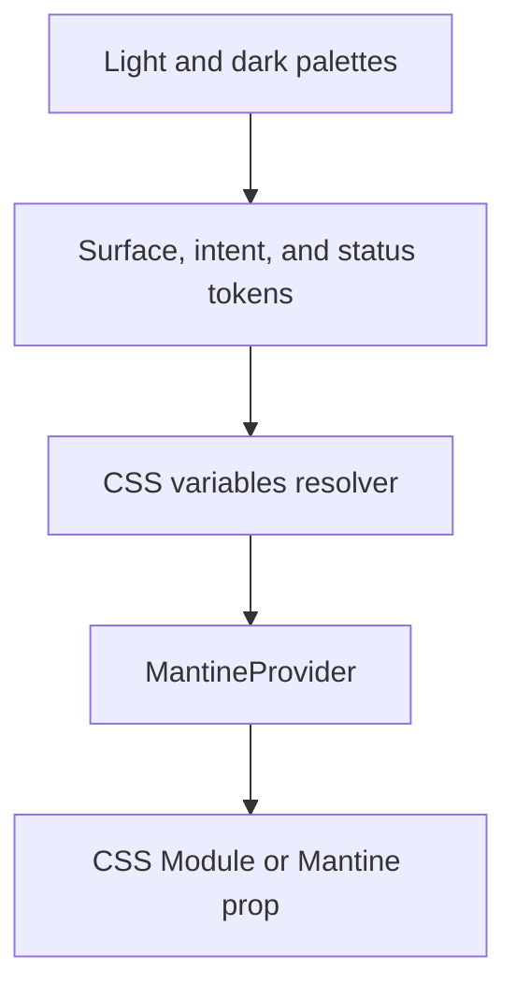

# Theme System

The theme is shared UI infrastructure. Product capabilities consume semantic tokens; they do not
define global palettes.

## Files

```text
src/shared/ui/themes/
├── index.ts
├── resolver.ts
├── palette-light.ts
├── palette-dark.ts
├── surfaces.ts
├── intents.ts
├── status-colors.ts
└── theme-inputs.module.css
```

| File               | Responsibility                                         |
| ------------------ | ------------------------------------------------------ |
| `palette-*.ts`     | raw color scales for each color scheme                 |
| `surfaces.ts`      | body, elevated, border, text, and muted surfaces       |
| `intents.ts`       | semantic action colors such as confirm and destructive |
| `status-colors.ts` | product-neutral status presentation                    |
| `resolver.ts`      | Mantine CSS variable generation                        |
| `index.ts`         | public theme and resolver                              |

## Flow



## Rules

1. Use semantic tokens for meaning; use raw palette values only while defining tokens.
2. Keep component layout in CSS Modules or Mantine props. Do not add inline style objects for
   static styling.
3. A capability may add local CSS variables, but it must not mutate global theme contracts.
4. Verify light and dark schemes for every new semantic token.
5. Use icons and text independently of color for status and destructive actions.
6. Do not use `var()` inside Mantine color props that parse colors. Use CSS Modules or a resolved
   theme color.

## Adding A Token

1. Name the semantic role, not the current color.
2. Add light and dark values.
3. Expose the variable in `resolver.ts`.
4. Add a palette story or focused test.
5. Inspect contrast and hover/focus states in both schemes.

## Component Ownership

- global design primitives: `src/shared/ui/components`;
- capability-specific components: `src/modules/<capability>/ui`;
- route-only composition: `src/app/**/_internal/ui`.

Do not promote a component to shared UI merely because two screens look similar. The interaction
contract and change cadence must also match.

## Verification

```bash
bun run storybook
bun run build-storybook
bun test src/shared/ui/themes
```

Inspect representative pages and stories at desktop and mobile widths in light and dark mode.
