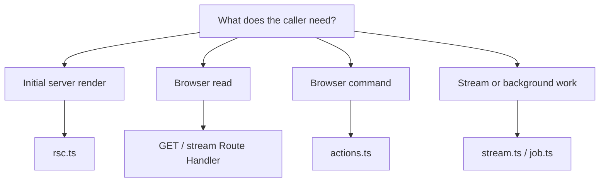

# First Capability

Use `src/modules/work-items` as the CRUD reference and
`src/modules/assistant-suggestions` as the cross-capability orchestration reference.

## 1. Name The Owner

Choose a product capability, not a technical noun. Prefer `billing`, `work-items`, or `identity`
over `api`, `services`, or `database`.

```text
src/modules/<capability>/
```

## 2. Add Only Needed Segments

| Need                                   | Add            |
| -------------------------------------- | -------------- |
| Schemas and pure policy                | `domain/`      |
| Behavior that passes the deletion test | `application/` |
| Stores and provider adapters           | `server/`      |
| TanStack Query and browser transports  | `client/`      |
| Reusable capability-owned components   | `ui/`          |

Segments are optional. Direct CRUD can live behind `server.ts` without an application wrapper.

## 3. Publish Runtime Surfaces

Create root files only when a consumer exists:

| Surface                | Consumer                                            |
| ---------------------- | --------------------------------------------------- |
| `server.ts`            | trusted in-process server code                      |
| `rsc.ts`               | Server Components and prefetch                      |
| `actions.ts`           | browser mutation commands                           |
| `client.ts`            | browser queries/subscriptions                       |
| `ui.ts`                | reusable capability UI                              |
| `cache.ts`             | query keys shared by RSC prefetch and browser cache |
| `stream.ts` / `job.ts` | long-lived or background channels                   |

Other capabilities may import these files, never private segments.

## 4. Choose The Channel



Server Actions are commands, not browser query transports.

## 5. Test At Owned Boundaries

- pure domain policy without mocks;
- application behavior with typed fakes;
- private stores against provider behavior;
- public server surfaces for authorization and failures;
- Route Handlers for decoding and HTTP mapping;
- client hooks with fetch/action adapters mocked;
- one E2E path for critical behavior.

## 6. Verify

```bash
bun run lint .
bun run architecture:check
bun run typecheck
bun test
bun run build
```
