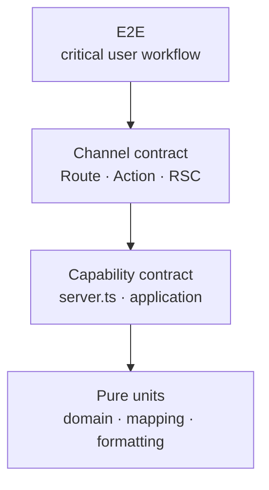

# Testing Strategy

Test behavior at the boundary that owns it. Prefer fast tests around pure code and capability
contracts; keep a small E2E set for user-visible workflows.

## Stack

| Scope                | Tool                       |
| -------------------- | -------------------------- |
| Unit and integration | Bun test + happy-dom       |
| React                | Testing Library + jest-dom |
| E2E                  | Playwright                 |
| Coverage             | Bun lcov/text reporters    |

## Test Shape



Most tests belong in the lower two levels.

## Commands

| Command                         | Purpose                                 |
| ------------------------------- | --------------------------------------- |
| `bun test`                      | all unit and integration tests          |
| `bun test path/to/file.test.ts` | one file                                |
| `bun run test:watch`            | watch mode                              |
| `bun run test:coverage`         | text and lcov coverage                  |
| `bun run test:ci`               | deterministic single-concurrency CI run |
| `bun run test:e2e`              | Playwright suite                        |

## What To Test

### Domain

Parse schemas and call pure policy directly. No mocks.

```ts
import { expect, test } from 'bun:test'
import { parse } from 'valibot'
import { WorkItemSchema } from '@/modules/work-items/domain/work-item'

test('normalizes a work item title', () => {
  const item = parse(WorkItemSchema, validWorkItem({ title: '  Ship  ' }))
  expect(item.title).toBe('Ship')
})
```

### Application

Inject typed ports. Test policy, branching, orchestration, and failures. Do not construct Next.js
or Supabase objects.

`src/modules/assistant-suggestions/application/generate-assistant-suggestions.test.ts` is the
reference.

### Private Server Adapter

Test provider mapping and error normalization at the adapter. Use the shared Supabase fake when it
models the required behavior; use a real integration database for query semantics the fake cannot
represent.

### Capability Server Surface

Test identity, authorization, validation, cache effects, and typed failures through `server.ts`.
Do not assert private call order unless order is part of the contract.

### Route Handler

Test query/body decoding and HTTP mapping through exported handlers. Cover invalid input, expected
failure, unexpected failure, and success. Route tests must not duplicate application tests.

### Server Action

Test mutation commands through `actions.ts`. Verify input schema, provider authentication, product
identity resolution, result shape, and any assigned server-cache invalidation. Test TanStack Query
invalidation in the client mutation. Browser reads belong in Route Handler tests, not Action tests.

### Client Query

Mock the capability transport exposed from `client.ts`, not private stores or Supabase. Wrap hooks
with `tests/utils/render.tsx`.

### Components

Call named hooks directly in controller components. Test pure views with explicit props when a view
has a separate contract; otherwise test the component behavior through visible output and user
events. Do not test implementation-only prop mapping.

### E2E

Cover one critical path per product workflow: authentication, protected navigation, and baseline
CRUD. Use `.agents/skills/e2e-testing/SKILL.md` when authoring a new scenario.

## Mocking Boundary

| Test target               | Mock                                                   |
| ------------------------- | ------------------------------------------------------ |
| application operation     | its typed ports                                        |
| capability server surface | private store/provider                                 |
| Route Handler             | capability server surface when HTTP only is under test |
| client query hook         | fetch/action transport                                 |
| component                 | capability client hook or browser API                  |

Do not mock through several ownership boundaries at once. Such a test can stay green while the
actual contract breaks.

## Coverage

Coverage percentages are diagnostic, not architecture. Require:

- every domain branch and failure code;
- application happy/failure paths;
- every trust-transition rejection;
- one regression test per fixed bug;
- one E2E smoke per critical user workflow.

## Location

- co-locate unit tests with owned code as `*.test.ts` or `*.test.tsx`;
- keep Route Handler tests under the route;
- keep E2E tests under `e2e/`;
- keep shared builders in `tests/fixtures/`.

The Stop hook runs static checks, not tests. Run the relevant tests before handing off a change.
